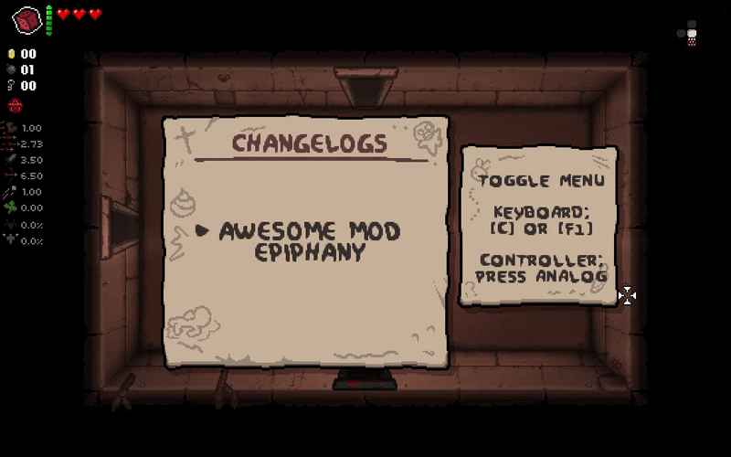

# Adding changelogs

## Intro

We're going to add changelogs to our mod that will appear along with changelogs from other enabled mods. When new changelogs are added, a popup will appear for the player, letting them know of the change.

## Setting up

Changelogs tend to be quite long. To keep things organized, you generally want to keep all the changelogs in a dedicated file.\
\
Let's create a new file in our mod called `changelogs.lua`. Make sure you `include` it in your `main.lua` file, or else it won't be loaded.

```lua
include("changelogs") -- This should be the path to your changelogs file
```

## Adding changelogs

Adding changelogs is super easy. Just use the `AddChangelog` function of the `DeadSeaScrollsMenu` global.

* The first argument is variadic and can be up to 4 arguments long. It is used to categorize your changelogs and place them under up to 4 layers of buttons. Typically, the first argument is your mod's name and the second argument is the version your changelogs are for.
* The final argument should be the string that is your changelog. You can define a long string with two square bracket pairs. Long strings can span across multiple lines without needing to define a new line with .

Unlike other strings, the strings provided in these arguments are automatically converted to lowercase. This lets you copy and paste changelogs from other places without needing to edit much.

```lua
DeadSeaScrollsMenu.AddChangelog("Awesome Mod", "v1.0.0", [[I made this awesome mod!

It is just so cool.

Thanks for playing!!!
]])
```

<figure><figcaption><p>All mods with changelogs added will appear on the main changelogs page</p></figcaption></figure>

## Formatting codes

You can add formatting codes to your changelogs. These can do various things, such as changing font size and text color.



You can edit the font size of a line by adding a font size tag to the beginning of it. The font size is 1 by default. There is no tag for setting the size to 1.

| Code     | Description             |
| -------- | ----------------------- |
| {FSIZE2} | A large font size.      |
| {FSIZE3} | A very large font size. |


```lua
DeadSeaScrollsMenu.AddChangelog("Awesome Mod", "v1.0.0", [[I made this awesome mod!

{FSIZE2}It is just so cool.

{FSIZE3}Bye!]])
```



Font size codes will remove any text before them in the line, so they should always be used at the start of a new line.


<figure><figcaption></figcaption></figure>



You can change the color of a chunk of text by wrapping it in a color tag.

| Code   | Description                                         |
| ------ | --------------------------------------------------- |
| {CLR1} | Text will be invisible.                             |
| {CLR2} | Text will be the primary text color of the theme.   |
| {CLR3} | Text will be the secondary text color of the theme. |

```lua
DeadSeaScrollsMenu.AddChangelog("Awesome Mod", "v1.0.0", [[{FSIZE2}{CLR1I made}{CLR3this awesome mod!}

{FSIZE2}{CLR2It is just so cool}.

{FSIZE2}{CLR3Bye!}]])
```


If you're going to use multiple color codes in a single line, do not add a space between the code and whatever comes before or after it. Doing so will remove some characters in your sentence.


<figure><figcaption></figcaption></figure>



When giving DSS a string you usually have to make all readable text lowercase, else the uppercase characters will appear as a different character. DSS does not require this with changelogs and will automatically convert your string to lowercase. If you do not want this behavior, you can wrap it in this tag.

```lua
DeadSeaScrollsMenu.AddChangelog("Awesome Mod", "v1.0.0", [[

THIS TEXT APPEARS NORMALLY
EVEN THOUGH IT IS UPPERCASE

{SYMTHIS TEXT DOES NOT APPEAR NORMALLY!}

]])
```

<figure><figcaption></figcaption></figure>



You can download the example mod and inspect how it works below.


